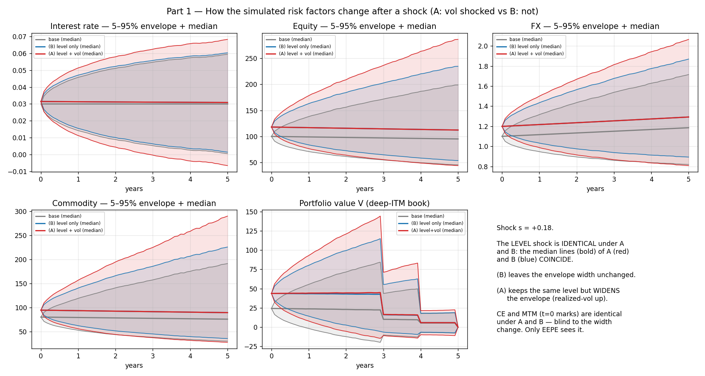
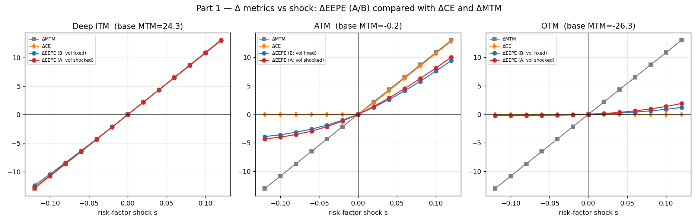
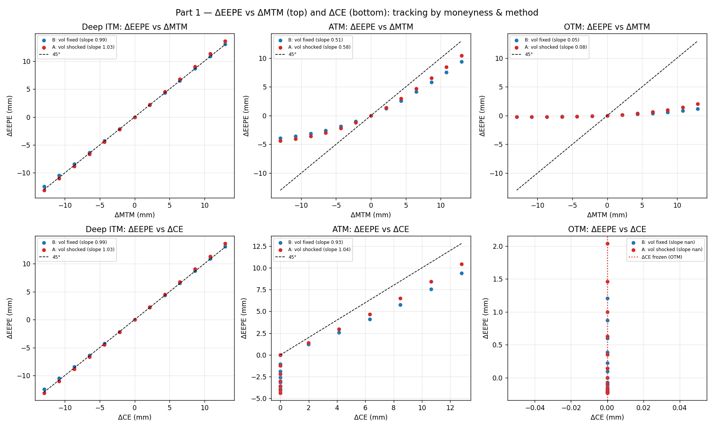
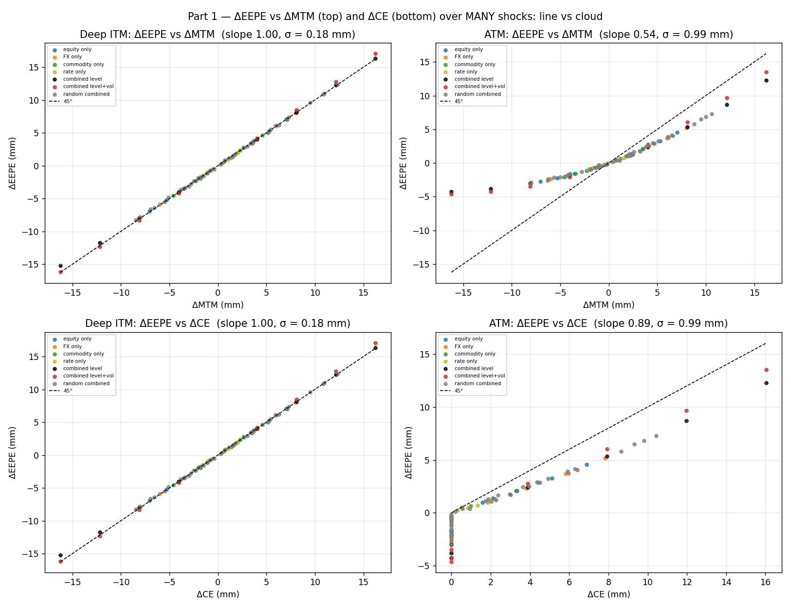
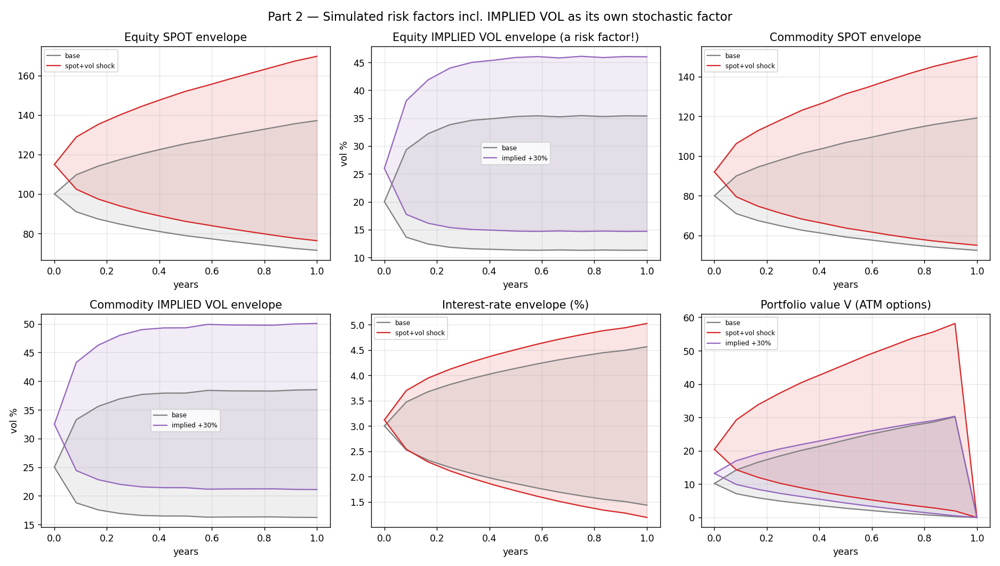
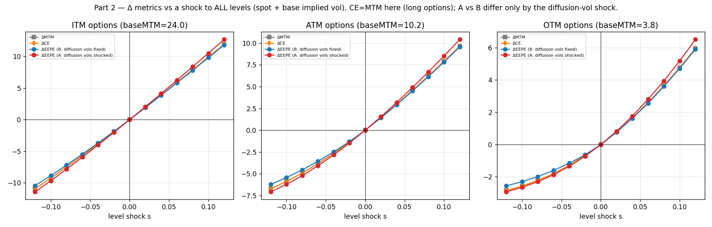
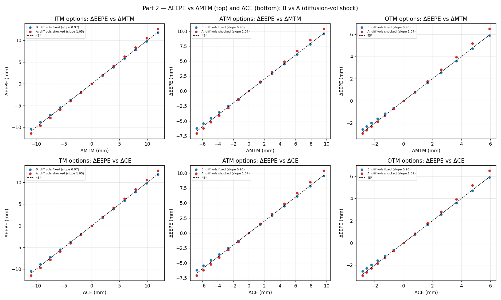
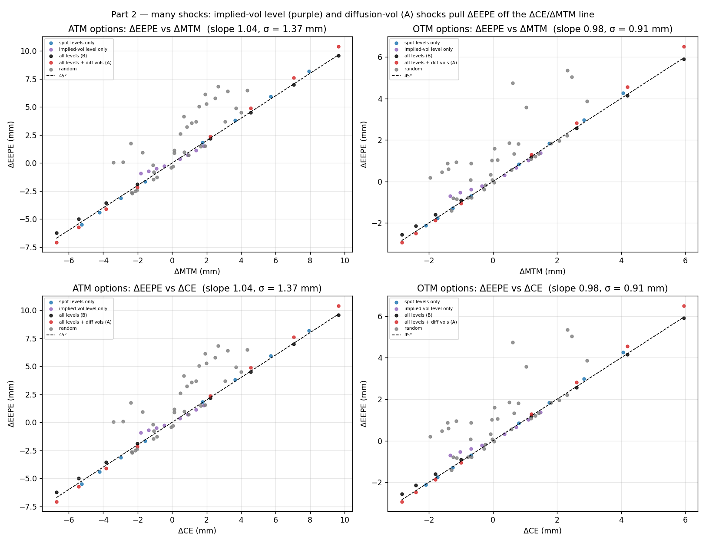

# When Does Current Exposure Track EEPE? A Simulation Study of Exposure Proxies under Market Shocks

*A reproducible study of how the change in Effective Expected Positive Exposure (ΔEEPE) relates to the change in Current Exposure (ΔCE) and Mark-to-Market (ΔMTM) for linear and non-linear counterparty portfolios, with implied volatility treated as a distinct risk factor.*

---

## Abstract

Counterparty credit risk capital under the Internal Model Method is driven by **EEPE** (Effective Expected Positive Exposure), obtained from a full Monte-Carlo simulation of future exposure. Because that simulation is expensive, practitioners frequently use the **change in current exposure (ΔCE)** — or the change in mark-to-market (ΔMTM) — as a cheap proxy for the change in EEPE in pre-deal checks, limit monitoring, and what-if analysis. This paper asks, quantitatively, **when that proxy is reliable and when it fails**. Using a transparent multi-asset Monte-Carlo engine, we study a linear portfolio and a non-linear (options) portfolio across three moneyness regimes, under two shock methodologies (with and without shocking the *simulation* volatility) and — for the non-linear book — under shocks to a **stochastic implied-volatility risk factor** that is kept distinct from the realized simulation volatility. We find that (i) for **linear, deep-in-the-money** netting sets ΔCE tracks ΔEEPE almost one-for-one; (ii) tracking degrades at-the-money and **collapses out-of-the-money**, where CE floors at zero and becomes blind to the shock (an *anti-conservative* failure); (iii) whenever the shock changes the **simulation volatility**, EEPE moves while CE and MTM do not — a divergence invisible to the proxy; and (iv) for options, ΔCE tracks a **spot** shock (delta) but systematically **over-states** an **implied-vol** shock, with slope ≈ 2/3 explained by the **vega term structure**. We give closed-form intuition for each regime and a practical decision rule.

---

## 1. Introduction

For a netting set with counterparty $c$, the regulatory Exposure at Default under the Internal Model Method (IMM) is

$$\text{EAD} = \alpha \cdot \text{EEPE},\qquad \alpha = 1.4,$$

where EEPE is a time-average of the (non-decreasing) *Effective Expected Exposure* over the first year. Computing EEPE requires simulating all underlying risk factors forward, revaluing the portfolio on every path and time node, and aggregating — a calculation far too heavy to run for every pre-deal enquiry or intraday limit check. Consequently, desks and validators lean on a **sensitivity shortcut**: approximate the *change* in EEPE due to a market move (or a new trade) by the *change* in a cheap, closed-form quantity — the **current exposure** $\text{CE} = \max(V_0, 0)$, or the raw **mark-to-market** $V_0$.

The shortcut is attractive because CE and MTM are available instantly. But it is only a **first-order, level-based** approximation of a quantity that is a *tail-of-the-future*, and it is easy to point to cases where it breaks. This study makes the breakdown precise and reproducible. The central questions are:

1. For a **linear** portfolio, how does ΔEEPE compare with ΔCE and ΔMTM across **moneyness**, and how does the answer change when a shock also moves the **simulation (realized) volatility**?
2. For a **non-linear** portfolio of options, where **implied volatility is a genuine risk factor distinct from the realized volatility** used to diffuse the underlyings, how does ΔEEPE respond to a **spot** shock versus an **implied-vol** shock — and does ΔCE track either?

All code, data, and figures are reproducible from the accompanying repository.

---

## 2. Exposure measures and the proxy hypothesis

Let $V_j(t_k)$ be the netted portfolio value on Monte-Carlo path $j$ at time node $t_k$ (full netting, single netting set, uncollateralized). Define:

| Quantity | Definition | Interpretation |
|---|---|---|
| **MTM** | $V(0)$ | today's signed portfolio value |
| **CE** | $\max(V(0),0)$ | current (positive) exposure |
| **EE**$(t)$ | $\mathbb{E}\big[\max(V(t),0)\big]$ | expected exposure at $t$ |
| **EffEE**$(t)$ | $\max_{s\le t}\text{EE}(s)$ | non-decreasing envelope |
| **EEPE** | $\frac{1}{T_w}\sum_{t_k\le T_w}\text{EffEE}(t_k)\,\Delta t_k$ | 1-yr time-average of EffEE |

with $T_w=\min(1\text{yr},\text{maturity})$ and $\Delta t_k = t_k-t_{k-1}$. Because EffEE is a running maximum and $\text{EffEE}(0)=\text{CE}$, we always have

$$\text{EEPE}\ \ge\ \text{EPE}\ \ge\ \text{CE}\ \ge 0 .$$

The **proxy hypothesis** we test is:

$$\Delta\text{EEPE}\ \approx\ \Delta\text{CE}\quad(\text{equivalently } \Delta\text{EAD}\approx\alpha\,\Delta\text{CE}),\qquad \text{and}\qquad \Delta\text{EEPE}\ \approx\ \Delta\text{MTM}.$$

A key structural fact drives the whole study: **EE$(t)$ is the price of a call option on the netting-set value.** Writing $\text{EE}(t)=\mathbb{E}[\max(V_t,0)]$ shows it is a call payoff on $V_t$, whose "underlying" is the portfolio value and whose "volatility" is the *simulation* dispersion of $V_t$. Everything below follows from this observation: EEPE inherits **delta** (to spot/level), **vega** (to simulation dispersion), and a **kinked floor at $V=0$** — while CE is that same option evaluated at $t=0$, where the future has zero width.

---

## 3. Methodology

### 3.1 Risk-factor dynamics

Four asset classes are simulated jointly under correlated Brownian motions:

- **Interest rate** — Vasicek / Ornstein-Uhlenbeck short rate: $dr = \kappa(\theta-r)\,dt + \sigma_r\,dW$.
- **Equity, FX, commodity** — geometric Brownian motion: $dS/S = (r-q)\,dt + \sigma\,dW$.

Here $\sigma$ is the **realized (simulation) volatility** — the parameter that sets how far the scenario envelope spreads.

### 3.2 Implied volatility as a separate risk factor (non-linear book)

For the options portfolio, each option-bearing asset carries its **own stochastic implied volatility**, mean-reverting in log space with a leverage correlation to the underlying:

$$d\ln\sigma^{\text{imp}} = \kappa_v\big(\ln\theta_v - \ln\sigma^{\text{imp}}\big)\,dt + \nu\,dW^v,\qquad dW^v=\rho\,dW^S+\sqrt{1-\rho^2}\,dW^\perp .$$

Crucially, **$\sigma^{\text{imp}}$ (used to reprice options) is distinct from the realized $\sigma$ (used to diffuse the underlying).** They can be shocked independently.

### 3.3 Common random numbers and shocks

Draws are generated **once** and reused for every scenario, so Monte-Carlo noise cancels in the deltas ΔCE, ΔMTM, ΔEEPE. A **shock** perturbs the initial state instantaneously:

- **Level (delta) shock** $s$: multiplicative bump to spots, additive bump to the rate.
- **Realized-vol methodology**: **(B)** hold the simulation volatility fixed; **(A)** scale it with the shock. CE and MTM are $t=0$ marks and are *identical under A and B* — only EEPE can tell them apart.
- **Implied-vol shock** (non-linear book): shift the implied-vol level (a persistent shift of the mean-reversion target, holding vol-of-vol constant).

### 3.4 Portfolios and moneyness

The **linear** book is an IR payer swap plus equity/FX/commodity forwards; the **non-linear** book is long options (rate/equity/FX/commodity). Three moneyness cases are constructed by placing strikes relative to the forward, giving deep-ITM, ATM, and OTM netting sets.

---

## 4. Part 1 — Linear portfolio

### 4.1 How the simulations change under a shock

**Figure 1.** For each risk factor and for the portfolio value, the base 5–95% path envelope (grey), the level-only shock (B, blue), and the level+vol shock (A, red). Methodology **(B) shifts each envelope's level** while leaving its width unchanged; methodology **(A) shifts the level *and* widens the envelope**. Because CE and MTM are $t=0$ marks, they are **identical under A and B** — they cannot see the width change. Only EEPE, which integrates over the widened future, responds to it.

### 4.2 Tracking by moneyness and methodology

**Figure 2.** Δ metrics versus the shock $s$, per moneyness case. Findings:

- **Deep ITM** — ΔMTM, ΔCE and ΔEEPE (both A and B) coincide: the proxy is excellent (slope ≈ 1.0).
- **ATM** — ΔMTM is linear, but ΔCE develops the $\max(\cdot,0)$ **kink** at zero, and ΔEEPE is the *smoothed* version (positive on both sides). The vol-shocked case (A) lies above the vol-fixed case (B).
- **OTM** — ΔCE is **frozen at zero** (the netting set never becomes positive over the shock range), while ΔMTM stays fully alive and ΔEEPE responds smoothly. CE carries no information.

**Figure 3.** ΔEEPE against ΔMTM (top) and ΔCE (bottom). Measured slopes: deep-ITM ≈ 0.99; ATM ≈ 0.93 versus ΔCE but ≈ 0.51 versus ΔMTM (the hockey-stick smoothing); OTM ΔEEPE-vs-ΔCE is **degenerate** (ΔCE ≡ 0). The bottom-right panel shows the OTM cells collapsing onto a vertical line: *one* value of ΔCE, a *range* of ΔEEPE.

> **Why the positive-quadrant slope is below 1 (linear).** MTM moves 1:1 with the shock, but EEPE moves at its *exposure delta*
> $$\frac{d\,\text{EEPE}}{dV_0}\approx\overline{P(V_t>0)}=\Phi(d)\le 1,$$
> the time-averaged probability that the netting set is in the money — $\approx 0.5$ at the money, $\to 0$ deep-OTM, and $\to 1$ only deep-ITM. So a positive shock pushes the book deeper ITM while its *time-value cushion* $\sigma_{\text{exp}}\sqrt{T}\,\varphi(d)$ erodes: CE and MTM rise at full speed, EEPE lags, and the two **converge**. Equivalently, EEPE sits *above* CE/MTM in level, but that gap **shrinks** with moneyness, so $\Delta\text{EEPE}<\Delta\text{CE}/\Delta\text{MTM}$ in the positive quadrant (and the reverse in the negative quadrant — a through-origin slope $<1$). This is a pure **netting-set $\max(\cdot,0)$** effect: *no vega is involved*. It is the linear counterpart of the vega-term-structure mechanism in §5.3.

### 4.3 Line or cloud? Testing many different shocks

The scatters above sweep the *magnitude* of a **single** combined shock, so they trace a curve. A stronger test applies **many different shocks** — each risk factor independently, the combined shock, and random combinations — and asks whether ΔEEPE is genuinely a *function* of ΔCE.

**Figure 3b.** ΔEEPE against **ΔMTM (top)** and **ΔCE (bottom)**. *Deep-ITM:* every shock family collapses onto the 45° line (slope 1.00, residual σ ≈ 0.2 mm) — the proxy is reliable no matter which factor moves, because the $\max(\cdot,0)$ is inactive and $\text{EE}\approx\mathbb{E}[V]$. *ATM:* the same ΔMTM/ΔCE now maps to a **range** of ΔEEPE — vs ΔMTM the fit is slope 0.54 (the symmetric hockey-stick smoothing), vs ΔCE it is slope 0.89 with the vertical OTM-flooring stripe at ΔCE = 0; residual σ ≈ 1.0 mm either way. The spread arises because EEPE depends on the *volatility of the factor that moved*, not just on ΔMTM/ΔCE (a commodity move at 25% vol adds more exposure dispersion than an FX move at 10% for the same level change). **The proxy is a line only deep-ITM; it becomes a cloud at the money.**

### 4.4 Findings (linear)

1. **Deep ITM ⇒ tracks.** With the netting set clear of zero and no vega, ΔCE ≈ ΔMTM ≈ ΔEEPE.
2. **Moneyness is the first gate.** EEPE is the smoothed hockey-stick $\mathbb{E}[\max(V_0+\sigma_{\text{exp}}\sqrt{T}\,Z,0)]$ in $V_0$. CE is its kinked $t=0$ shadow. They agree only where $V_0$ is many exposure-sigmas from zero.
3. **Shocking the simulation vol is invisible to CE/MTM.** A linear book has *zero vega*, so ΔCE and ΔMTM are the same whether or not the shock moves $\sigma$; ΔEEPE is not. This is the cleanest statement that EEPE carries risk the proxy cannot.

These are made exact in **Appendix B**, which derives the linear law $\Delta\text{EE}(t)/\Delta\text{MTM} = \Phi(\text{moneyness}/\text{dispersion})$ — the sensitivity ratio is exactly the in-the-money probability, bounded by 1.

---

## 5. Part 2 — Non-linear portfolio (options), implied vol as a risk factor

Implied vol is a risk factor with **two** attributes: a **level** (the base implied vol) and a **diffusion vol** (its vol-of-vol). The shock methodology therefore mirrors Part 1 exactly, now applied to *all* factors including implied vol:

- **(B)** shock all **levels** — spot levels *and* base implied vol — with **no** diffusion-vol shock (realized spot vol fixed *and* vol-of-vol fixed).
- **(A)** shock all levels **and** all diffusion vols (realized spot vol *and* vol-of-vol).

Because CE and MTM are $t=0$ marks, they respond to the level shock (spot **delta** + implied-vol **vega**) but are **identical under A and B** — blind to the diffusion/width change.

### 5.1 The simulated risk factors, including implied vol

**Figure 4.** Spot and **implied-volatility** envelopes (each a risk factor with its own fan), plus the portfolio value, under base / **(B)** / **(A)**. Read the implied-vol panels: under **(B)** the base implied vol is shocked up (median lifts, e.g. 20%→24.5%) with the **same fan width**; under **(A)** the median coincides but the **fan is wider** because the vol-of-vol is also shocked. The start markers and medians of A and B coincide throughout — the level shock is identical; only the diffusion width differs.

### 5.2 A unified level shock, with and without a diffusion-vol shock

**Figure 5.** Δ metrics vs the level shock $s$, per moneyness. ΔMTM and ΔCE coincide (long options, $V_0>0$) and carry both the spot **delta** and the implied-vol **vega**. **ΔEEPE(B)** sits **just below** them (slope ≈ 0.96–0.98) — the implied-vol *level* component contributes a **damped** vega to EEPE (§5.3). **ΔEEPE(A)** sits **just above** (slope ≈ 1.05–1.07) — shocking the diffusion vols widens the envelope, adding exposure that CE/MTM cannot see. A and B differ *only* by the diffusion-vol shock.

**Figure 6.** ΔEEPE vs ΔMTM (top) and ΔCE (bottom), B vs A. B lies just inside the 45° line (damped implied-vol vega); A just outside it (diffusion widening). The gap between the A and B point clouds is exactly the diffusion-vol contribution — the part of ΔEEPE invisible to CE/MTM.

**Figure 6b.** Many different shocks. **Spot-level** shocks (blue) lie on the 45° line; **implied-vol-level** shocks (purple) fall *below* it (damped vega); **random** shocks that also move the diffusion vols (grey) scatter *above* it. The residual σ (≈ 1.4 mm at ATM) is the irreducible proxy error once the implied-vol level and the diffusion vols — neither of which CE/MTM fully capture — are in play.

### 5.3 Why implied-vol tracking has slope ≈ 2/3 — the vega term structure

CE and EEPE feel the *same* implied-vol bump; what differs is the **vega it multiplies**. CE marks the option at its **longest maturity** ($\tau=T$), where vega is largest ($\text{vega}\propto\sqrt{\tau}$). EEPE averages the exposure over the profile, where the *same* option has **aged** ($\tau=T-t$) and its vega has decayed toward zero at expiry. The average of a decaying vega is below the $t=0$ value:

$$\frac{\Delta\text{EEPE}}{\Delta\text{CE}}\ \approx\ \frac{\frac{1}{T}\int_0^{T}\sqrt{T-t}\,dt}{\sqrt{T}}\ =\ \frac{2}{3},$$

matching the ≈ 0.66 slope measured for a *pure* implied-vol-level shock. In the **unified** level shock (Figure 5) this vega enters only as the *implied-vol component* of a shock that is mostly spot **delta**, so the blended slope of ΔEEPE(B) is ≈ 0.96 — the delta part tracks at 1 and the implied-vol part drags it slightly below. (If the implied-vol shock also *mean-reverts* rather than persisting, a second decay compounds the wedge.) The bias is direction-dependent: for a **vol increase** CE over-states the exposure rise — *conservative* — whereas a *diffusion*-vol move (methodology A / §4.4) moves EEPE while leaving CE flat — *anti-conservative*.

> **Why the positive-quadrant slope is below 1 (non-linear).** On an up-shock (spot **and** base implied vol rising), $\Delta\text{CE}=\Delta\text{MTM}$ exceeds $\Delta\text{EEPE}(B)$ because CE books the implied-vol bump at the option's **full-maturity vega** while EEPE averages a **decaying** vega over the aging profile (the $\approx 2/3$ factor above). The spot-delta part tracks at 1; the implied-vol part drags the blend to $\approx 0.96$. This is the **instrument-option vega** counterpart of the linear **exposure-delta** effect (§4.2) — a *different* mechanism (vega vs the netting-set $\max$), *same* sign. Methodology **A** then adds envelope width (invisible to CE/MTM) and pushes the slope back above 1.

### 5.4 Findings (non-linear)

1. **Level shock: B tracks with a small vega drag; A adds diffusion width.** Shocking all levels (spot + base implied vol) gives ΔEEPE(B)/ΔCE ≈ 0.96–0.98 — the spot delta tracks at 1, the implied-vol *level* adds a damped-vega drag. Additionally shocking the diffusion vols (realized *and* vol-of-vol) lifts it to ΔEEPE(A)/ΔCE ≈ 1.05–1.07. **CE and MTM are identical under A and B**, so the entire A–B gap is exposure invisible to the proxy.
2. **Optionality per se does not break the proxy** — a long-premium book keeps $V_0>0$, so CE inherits the gamma and vega. What the proxy cannot see is the **diffusion** dimension (realized vol and vol-of-vol) and the **vega term structure** of the implied-vol level.
3. **Implied ≠ realized, and level ≠ diffusion.** Implied vol carries a level (seen by CE) and a vol-of-vol (unseen); realized vol is a third, separate parameter (also unseen). Treating any of these as one number hides real exposure.

---

## 6. Discussion

### 6.1 A regime map for the proxy

| Regime / shock | ΔCE vs ΔEEPE | Mechanism | Capital direction |
|---|---|---|---|
| Linear, deep-ITM, level shock | **tracks (≈1)** | max inactive, no vega | — |
| Linear, ATM, level shock | partial | hockey-stick kink | mixed |
| Linear, OTM, level shock | **fails (CE frozen)** | $\text{CE}=0$, zero delta | **anti-conservative** |
| Any book, realized-vol shock | **fails (CE flat)** | CE has no vega | anti-conservative |
| Options, spot shock | tracks (≈1) | CE carries delta/gamma | — |
| Options, implied-vol shock | **over-states (≈2/3)** | vega term structure | conservative |

### 6.2 Relation to the standardized approach

The regulatory lineage of the proxy is **SA-CCR**: $\text{EAD}=1.4\,(\text{RC}+\text{PFE})$ with $\text{RC}=\max(V-C,0)$ (current exposure) plus an add-on whose maturity factor $\sqrt{\min(M,1\text{yr})}$ shrinks for short-dated trades — so for short, linear, in-the-money books $\text{EAD}\to 1.4\,\text{CE}$, exactly the regime where our proxy is tight. SA-CCR's **multiplier**, floored at 5%, keeps $\text{PFE}>0$ when the netting set is OTM — the very case where a naive ΔCE proxy reports zero.

### 6.3 Practical rule

1. **Gate on moneyness.** Compute $m=V_0/(\sigma_{\text{exp}}\sqrt{T})$ (no Monte-Carlo needed: $\sigma_{\text{exp}}^2=\delta^\top\Sigma\delta$). If $|m|\lesssim 2$ or the book is OTM, do not trust ΔCE — run EEPE (or use the SA-CCR PFE).
2. **Decompose the shock.** Apply the proxy to the **delta** component (slope ≈ 1) and treat the **vega** component with a term-structure haircut (≈ 2/3), or re-simulate.
3. **Never proxy a realized-vol / vol-of-vol move with CE** — CE is structurally blind to it.
4. **Back-test** ΔCE against full-revaluation ΔEEPE, stratified by moneyness and by shock type.

---

## 7. Conclusion

Current exposure is a good proxy for EEPE **only inside a well-defined regime**: linear (or delta-dominated), uncollateralized, in-the-money netting sets under level shocks that leave the simulation volatility unchanged. Outside it, the proxy fails in structured, predictable ways — CE freezes out-of-the-money (anti-conservative), ignores realized-volatility moves entirely, and over-states implied-volatility moves by the vega term-structure factor of roughly two-thirds. Recognizing *which* regime a netting set and a shock fall into — a moneyness test plus a delta/vega decomposition — is what separates a safe pre-deal shortcut from a mis-stated capital number.

---

## Appendix A — Monte-Carlo estimators

$$\widehat{\text{EE}}(t_k)=\frac{1}{M}\sum_{j=1}^{M}\max(V_j(t_k),0),\quad \widehat{\text{EffEE}}(t_k)=\max_{l\le k}\widehat{\text{EE}}(t_l),\quad \widehat{\text{EEPE}}=\frac{1}{T_w}\sum_{t_k\le T_w}\widehat{\text{EffEE}}(t_k)\Delta t_k.$$

Non-discounted EE is used throughout; antithetic variates and common random numbers reduce variance and make the deltas clean. Collateralized exposure replaces $\max(V_t,0)$ with $\max(V_t-C_{t-\delta}-\text{IM},0)$ over a margin period of risk $\delta$.

## Appendix B — The linear law: ΔEE(t) vs ΔMTM under an instantaneous shock

We derive, for a **linear** portfolio, the exact relationship between the change in expected exposure at a future date and the change in today's mark-to-market. Working with EE(t) suffices — EEPE follows by time-averaging.

**Setup.** One risk factor $X$ with $X(0)=x_0$; an instantaneous shock $\varepsilon$ is applied to $x_0$ at $t_0$. A *linear* portfolio is affine in the factor,
$$V(t) = D(t)\,X(t) + b(t),$$
with $D(t)=\partial V(t)/\partial X(t)$ and $b(t)$ **deterministic** (state-independent — i.e. zero gamma). $D(t)$ may vary with $t$ (carry, roll-off) but is the same on every path.

**Propagation.** The shock reaches time $t$ through the tangent factor $\pi(t)=\partial X(t)/\partial x_0$, $\pi(0)=1$, fixed by the dynamics: $\pi(t)=X(t)/x_0$ for GBM (**persists**), $\pi(t)=e^{-\kappa t}$ for a mean-reverting factor (**decays**). Linearity makes the shocked path exactly $X(t)+\varepsilon\,\pi(t)$, so
$$\Delta V(t) = D(t)\,\pi(t)\,\varepsilon \qquad(\text{exact}).$$

**The two sensitivities.** At $t_0$, $\pi(0)=1$:
$$\Delta\text{MTM} = \Delta V(0) = D(0)\,\varepsilon.$$
Differentiating $\text{EE}(t)=\mathbb{E}[\max(V(t),0)]$ through the max (to first order in $\varepsilon$):
$$\Delta\text{EE}(t) = \mathbb{E}\big[\mathbf{1}\{V(t)>0\}\,\Delta V(t)\big] = \varepsilon\,D(t)\,\mathbb{E}\big[\mathbf{1}\{V(t)>0\}\,\pi(t)\big],$$
where the last step uses that $D(t)$ is **state-independent** and so pulls out of the path-expectation. This "pull-out" is the essence of linearity: no gamma, hence no path-dependent gearing.

**The ratio.** For a deterministic $\pi(t)$, $\mathbb{E}[\mathbf{1}\{V>0\}\,\pi]=\pi\,P(V>0)$, giving three state-independent factors:
$$\frac{\Delta\text{EE}(t)}{\Delta\text{MTM}} = \underbrace{\frac{D(t)}{D(0)}}_{\text{carry / roll-off}} \cdot \underbrace{\pi(t)}_{\text{persistence}} \cdot \underbrace{P(V(t)>0)}_{\text{floor (moneyness)}}.$$

**Closed form.** Zeroing the carry ($D(t)/D(0)=1$) and taking a parallel shift ($\pi(t)=1$), $V(t)$ is Normal with mean $=\text{MTM}$ and standard deviation $\sigma_{\exp}(t)$ (the exposure dispersion), so
$$\boxed{\ \frac{\Delta\text{EE}(t)}{\Delta\text{MTM}} = P(V(t)>0) = \Phi\!\left(\frac{\text{MTM}}{\sigma_{\exp}(t)}\right) = \Phi\!\left(\frac{\text{moneyness}}{\text{dispersion}}\right)\ }$$
with $\Phi$ the standard normal CDF: the sensitivity ratio is exactly the probability of being in the money.

**Example — FX forward** ($X_0=1.10$, $\sigma=0.11/\sqrt{\text{yr}}$, $t=0.5 \Rightarrow \sigma_{\exp}=0.078$):

| case | strike K | moneyness $X_0-K$ | $(X_0-K)/\sigma_{\exp}$ | $\Delta\text{EE}(t)/\Delta\text{MTM}=\Phi(\cdot)$ |
|---|---|---|---|---|
| ITM | 0.95 | +0.15 | +1.93 | 0.97 |
| ATM | 1.10 | 0.00 | 0.00 | 0.50 |
| OTM | 1.25 | −0.15 | −1.93 | 0.03 |

**Consequence.** Since $\Phi(\cdot)\le 1$, $\Delta\text{EE}(t)\le\Delta\text{MTM}$ for any linear book: the ratio is a genuine **fraction**, set by moneyness over dispersion — $\approx 1$ deep-ITM, exactly $0.5$ at the money, $\to 0$ deep-OTM — and pulled toward $0.5$ at long horizons as $\sigma_{\exp}(t)$ grows. A mean-reverting factor adds the $\pi(t)=e^{-\kappa t}<1$ dampener; an amortizing swap adds $D(t)/D(0)<1$. With no gamma, nothing can push the ratio above 1. This is the analytical backbone of the Part 1 results; the non-linear case (§5) replaces the deterministic $D(t)$ with a state-dependent one whose conditional average $\mathbb{E}[D(t)\mid V(t)>0]$ can exceed $D(0)$, allowing the ratio to exceed 1.

## References (indicative)

- Basel Committee on Banking Supervision, *The standardised approach for measuring counterparty credit risk exposures* (d279), 2014.
- E. Canabarro and D. Duffie, "Measuring and Marking Counterparty Risk," 2003.
- M. Pykhtin and S. Zhu, "A Guide to Modeling Counterparty Credit Risk," *GARP Risk Review*, 2007.
- J. Gregory, *The xVA Challenge*, Wiley.
